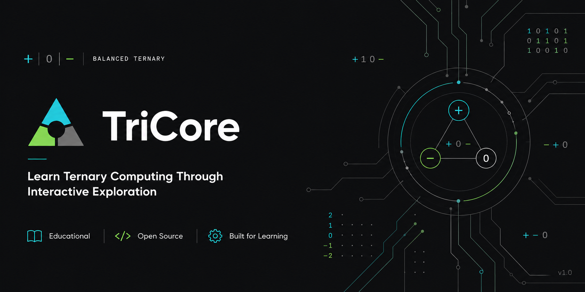

<p align="center">
  
</p>

<h1 align="center">TriCore</h1>

<p align="center">
  <strong>An Interactive Platform for Learning Ternary Computing, Digital Logic, and Computer Architecture</strong>
</p>

<p align="center">
  Built in Python • Educational • Open Source
</p>

---

# 📖 About

TriCore is an educational computer science platform designed to teach the foundations of number systems, ternary arithmetic, digital logic, and computer architecture through interactive simulations and hands-on experimentation.

Unlike traditional calculators and converters that simply produce answers, TriCore focuses on explaining how results are obtained. Every module is designed to help users understand the reasoning behind computations, logic operations, and circuit behavior.

The project combines theoretical learning with practical exploration, allowing students to move from basic number representations to building and simulating complete ternary logic circuits.

---

# ✨ Features

## 🔢 Number System Laboratory

Convert numbers between multiple numeral systems with detailed explanations.

Supported systems include:

* Decimal
* Binary
* Ternary
* Balanced Ternary

Features:

* Step-by-step conversions
* Educational explanations
* Input validation
* Conversion walkthroughs

---

## ➕ Ternary Arithmetic Engine

Perform arithmetic directly in base-3.

Supported operations:

* Addition
* Subtraction
* Multiplication
* Division

Educational tools:

* Carry visualization
* Borrow visualization
* Arithmetic breakdowns
* Formatted working steps

---

## 🧠 Digital Logic Laboratory

Learn the foundations of digital electronics and computer architecture through interactive lessons.

Topics include:

* Ternary Signals
* Logic Gates
* Ternary Logic
* Truth Tables
* Combinational Logic
* Digital Circuits
* CPU Applications

Each lesson includes definitions, explanations, examples, and practical applications.

---

## ⚡ Logic Gate Simulator

Experiment with ternary logic gates and observe their behavior in real time.

Supported gates:

| Gate | Description            |
| ---- | ---------------------- |
| NOT  | Ternary inversion      |
| MIN  | Ternary AND equivalent |
| MAX  | Ternary OR equivalent  |
| SUM  | Modulo-3 addition      |
| NMIN | Complement of MIN      |
| NMAX | Complement of MAX      |

Features:

* Interactive simulation
* Truth table generation
* Educational explanations
* Real-world applications

---

## 📋 Truth Table Generator

Automatically generate complete truth tables for supported ternary gates.

Features:

* Exhaustive input combinations
* Structured tabular output
* Educational reference material

---

## 🔌 Logic Circuit Simulator

Build and simulate complete ternary logic circuits.

Features:

* Input nodes
* Logic gate nodes
* Output nodes
* Circuit validation
* Topological evaluation
* Signal propagation tracing
* Built-in example circuits

Users can construct custom circuits and observe how ternary signals move through a network step by step.

---

## 📚 Interactive Learning Experience

TriCore emphasizes understanding rather than memorization.

Educational features include:

* Guided lessons
* Step-by-step explanations
* Interactive simulations
* Visualized signal propagation
* Beginner-friendly terminology

---

# 💡 Why TriCore?

Most educational tools focus on binary computing.

TriCore explores an alternative approach: **ternary computing**, where information is represented using three states:

```text
0 = LOW
1 = MID
2 = HIGH
```

Ternary systems provide an interesting perspective on computer architecture, digital logic design, and numerical representation.

TriCore was created to make these concepts accessible through experimentation and exploration.

---

# 📸 Screenshots

### Main Menu

*(Add screenshot here)*

### Logic Gate Simulator

*(Add screenshot here)*

### Logic Circuit Simulator

*(Add screenshot here)*

### Signal Propagation Trace

*(Add screenshot here)*

---

# 🚀 Installation

Clone the repository:

```bash
git clone https://github.com/Ja4deep/TriCore.git
```

Navigate to the project directory:

```bash
cd TriCore
```

Install dependencies:

```bash
pip install -r requirements.txt
```

Run the application:

```bash
python main.py
```

---

# 📁 Project Structure

```text
TriCore/
│
├── arithmetic/
├── balanced_ternary/
├── digital_logic/
├── logic_circuit_simulator/
├── ui/
├── tests/
├── assets/
│
├── main.py
└── README.md
```

---

# 🧪 Testing

Run the test suite using:

```bash
pytest
```

Current testing covers:

* Number system conversions
* Ternary arithmetic
* Logic gate evaluation
* Truth table generation
* Circuit validation
* Signal propagation
* Input validation
* Edge cases

---

# 🛠 Built With

* Python 3
* Object-Oriented Programming
* Terminal-Based User Interface
* Educational Simulation Design

---

# 🗺 Roadmap

Planned future additions include:

* Ternary Arithmetic Logic Unit (ALU)
* Register Simulation
* Memory Components
* Sequential Logic
* CPU Architecture Modules
* Enhanced Visualizations
* Additional Educational Content

---

# 🎯 Educational Goals

TriCore aims to:

* Teach number systems and numerical representation
* Introduce ternary computing concepts
* Demonstrate digital logic principles
* Visualize circuit behavior
* Encourage hands-on learning
* Make computer architecture accessible to students

---

# 📄 License

This project is licensed under the MIT License.

---

<div align="center">

### ⭐ If you find TriCore useful, consider starring the repository.

Your support helps the project grow and reach more learners.

</div>
